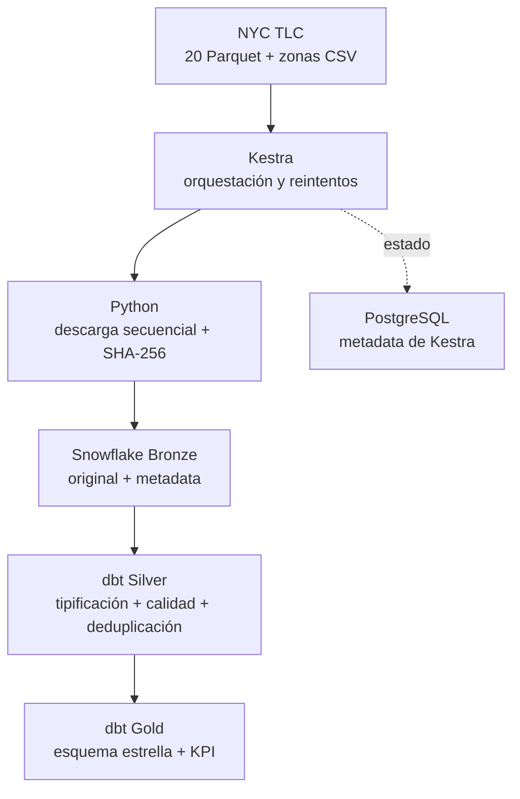
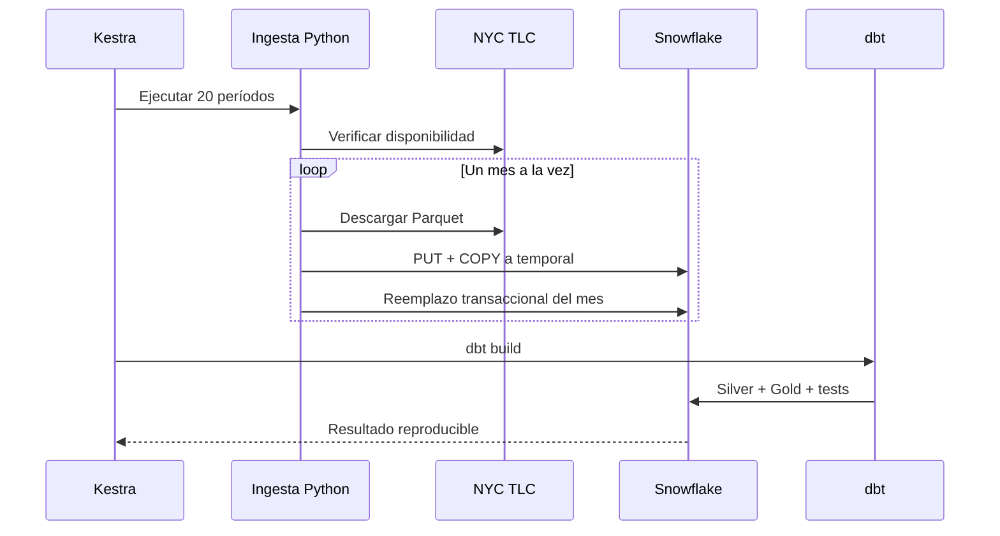

# Arquitectura de la solución

## Decisiones

- **ELT:** Python solo transporta y audita los datos; las transformaciones ocurren en Snowflake mediante dbt.
- **Un archivo a la vez:** no se almacenan los 20 Parquet simultáneamente. Cada archivo temporal se elimina después de cargarse, lo que reduce uso de disco y memoria.
- **Bronze tolerante a cambios:** cada fila Parquet se conserva como `VARIANT`. La verificación real encontró, por ejemplo, `request_source` en julio de 2026 aunque no estaba en enero de 2025; Bronze lo conserva sin romperse y Silver decide cuándo incorporarlo al modelo.
- **Carga atómica por período:** primero se llena una tabla temporal. Solo si terminó correctamente se reemplaza el mes en Bronze dentro de una transacción.
- **Reejecución:** la clave operativa es `SOURCE_PERIOD`; volver a cargar un mes lo reemplaza y no lo acumula.
- **Trazabilidad:** `SOURCE_FILE`, `SOURCE_PERIOD`, `SOURCE_ROW_NUMBER`, `LOADED_AT`, hash SHA-256 y conteo de filas permiten rastrear cada registro.
- **Recursos:** no se usa Spark porque el laboratorio no lo requiere y Snowflake/dbt ya ejecutan la transformación distribuida.

## Secuencia de una ejecución

