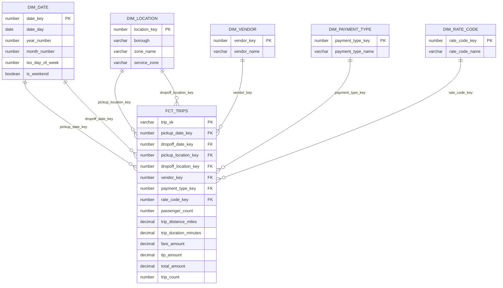

# Esquema estrella

## Grano

`GOLD.FCT_TRIPS` contiene **exactamente una fila por viaje Yellow Taxi válido y deduplicado**. El identificador técnico `TRIP_SK` se deriva del archivo y número de fila originales. `TRIP_COUNT` vale 1 y permite agregaciones explícitas.

## Claves

| Objeto | Primary key lógica | Uso |
|---|---|---|
| `FCT_TRIPS` | `TRIP_SK` | Identifica el viaje cargado desde una fila fuente. |
| `DIM_DATE` | `DATE_KEY` (`YYYYMMDD`) | Fecha de recogida y fecha de llegada. |
| `DIM_LOCATION` | `LOCATION_KEY` | Zona TLC de recogida y llegada. |
| `DIM_VENDOR` | `VENDOR_KEY` | Proveedor TPEP. |
| `DIM_PAYMENT_TYPE` | `PAYMENT_TYPE_KEY` | Forma de pago. |
| `DIM_RATE_CODE` | `RATE_CODE_KEY` | Tarifa final aplicada. |

Snowflake declara restricciones de forma informativa; la integridad se hace exigible mediante los tests `unique`, `not_null` y `relationships` de dbt.

## Métricas y atributos

- Métricas aditivas: viajes, pasajeros reportados, distancia, tarifa, propina, peajes, recargos y total cobrado.
- Métricas derivadas: duración en minutos y porcentaje de propina.
- Atributos de análisis: fecha, hora, zona, borough, proveedor, forma de pago, tarifa, bandera store-and-forward y anomalías de calidad.
- `GOLD.AGG_MONTHLY_KPIS` ofrece una salida mensual lista para revisión.

